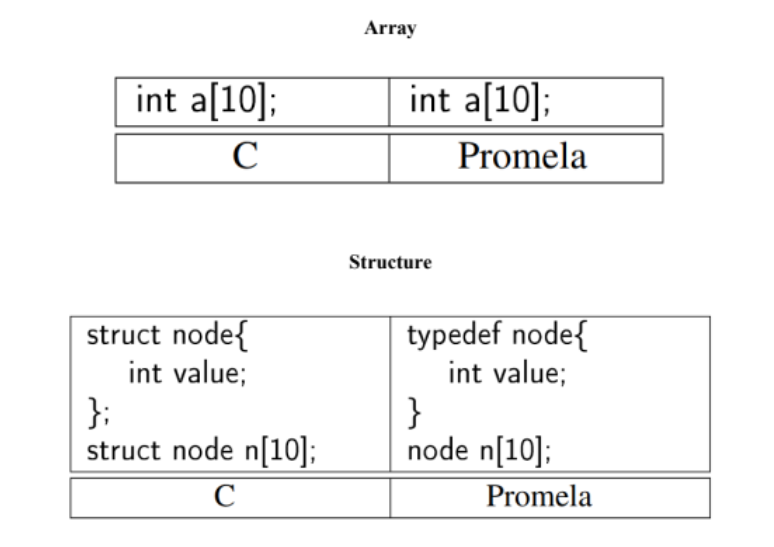
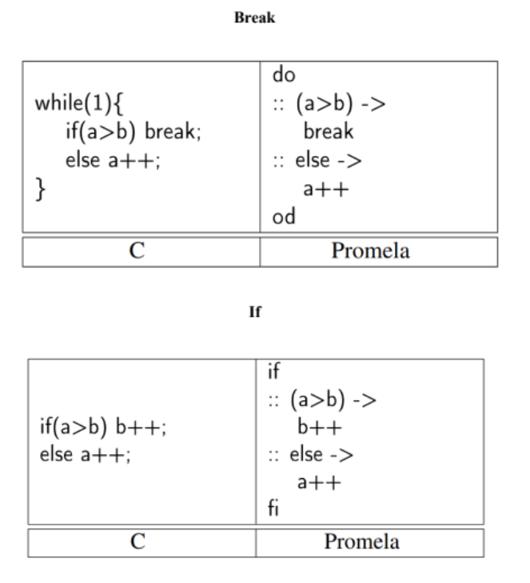
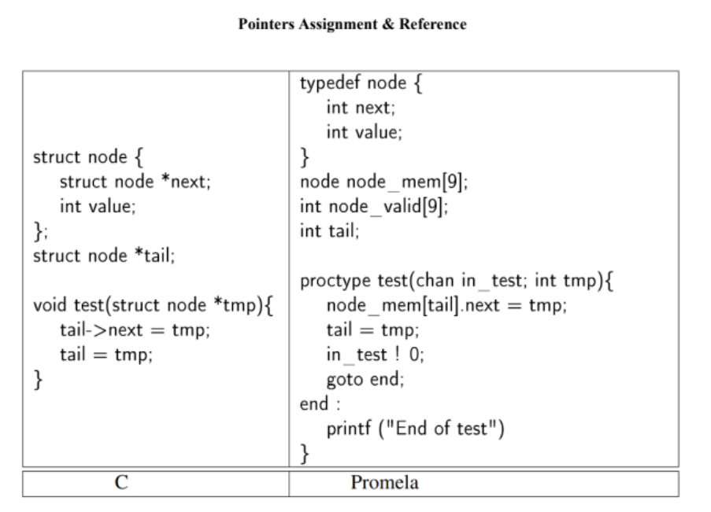

# C_to_Promela
Converting C to Provela using LLM &amp; Lex/Yac

● Leveraging Large Language Models (LLMs) to convert C code into Promela code by first transforming the C source into its Abstract Syntax Tree (AST) for improved accuracy, and then allowing agents to interpret and translate from the structured representation.

● Utilizing Lex for lexical analysis and Yacc for syntactic parsing to systematically convert C code into an intermediate representation suitable for further processing or translation.

# Examples of what it is meant to do

 

